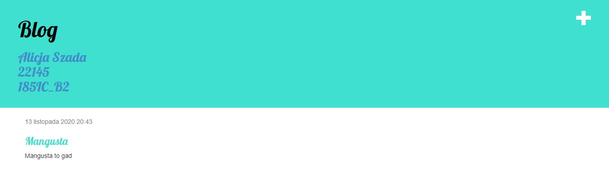
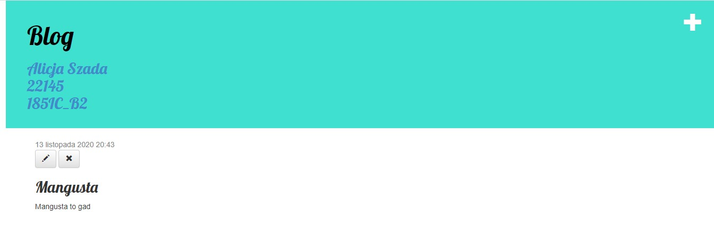
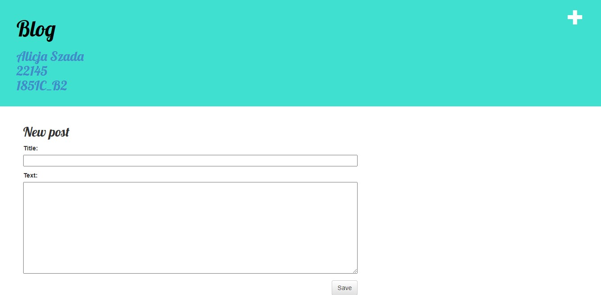
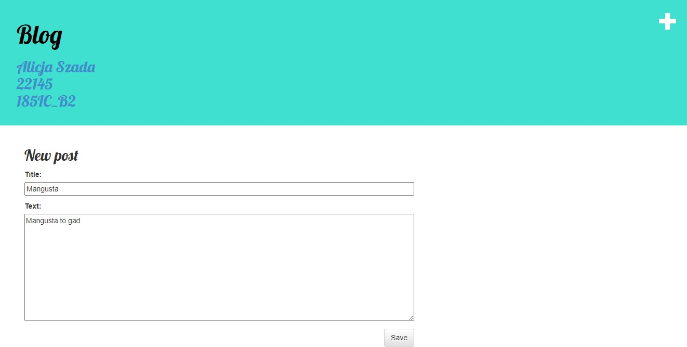

# Lab 1
## Tworzenie blogu na heroku
Widok główny blogu z postami  
Plus w prawym górnym rogu służy do dodawania nowego postu  

Widok po wejściu w post  
Dwa przyciski na stronie:  
Przycisk z ołówkiem służy do edycji posta  
Przycisk z "x" służy do usuwania posta

Widok dodawania nowego postu  

Widok edycji postu  
  
Bez zalogowania nie można dodawać/edytować/usuwać postów  
Link do blogu  
https://aplikacje-internetowe-22145.herokuapp.com/