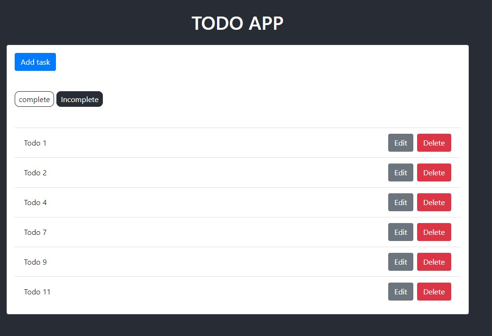
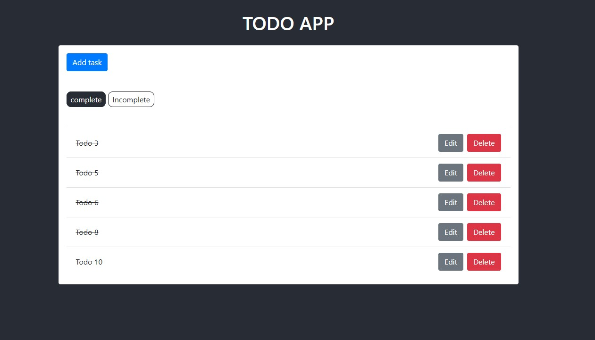
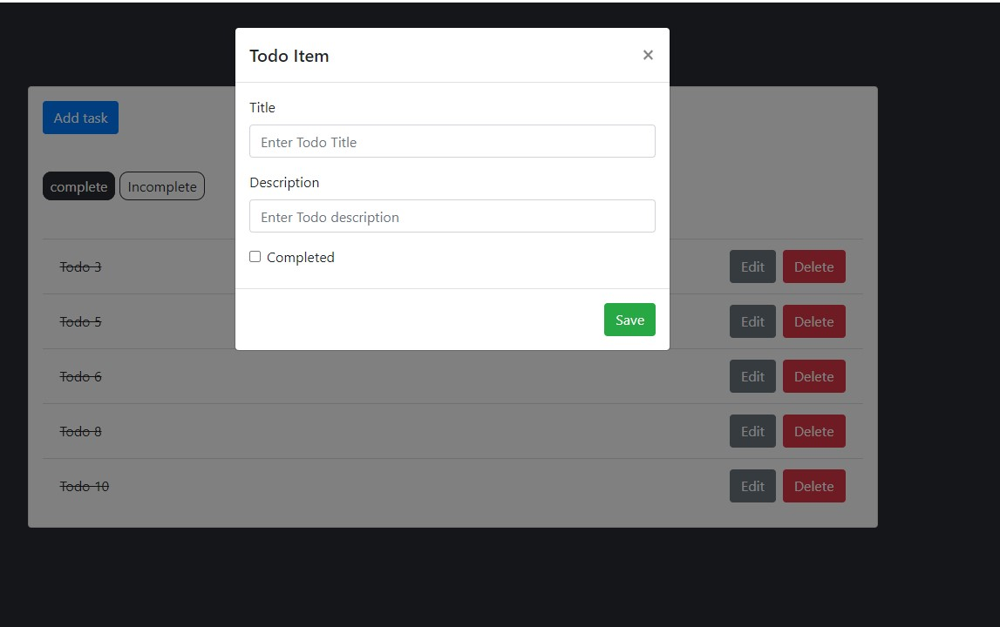
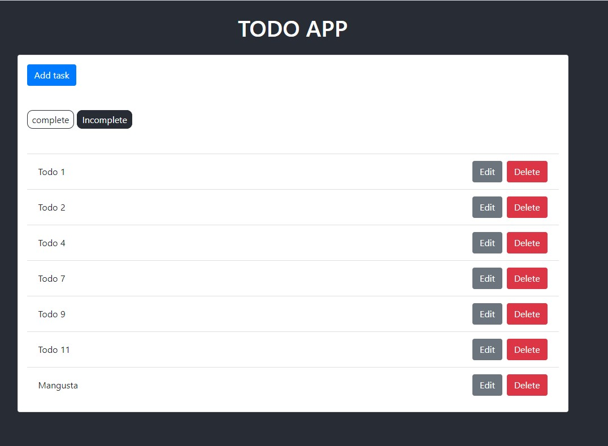

# Lab 10
## Django + React (aplikacja typu ToDo)
### Wygląd aplikacji
Zadania niewykonane

Zadania wykonane

Dodawanie zadania

Widok po dodaniu zadania do wykonania(niewykonane, zadanie Mangusta)
