# Lab 1
## Modyfikacja blogu 
### Dodanie logowania, wylogowywania, zmiany hasła i rejestracji
**Nowe pliki**
dashboard.html
register_done.html
register.html
**folder** registration wraz z plikami
**Pliki zmodyfikowane**
base.html
views.py
urls.py (w folderze blog)
forms.py
settings.py
__Reszta plików jest taka sama jak w folderze Lab1__
Widok logowania  
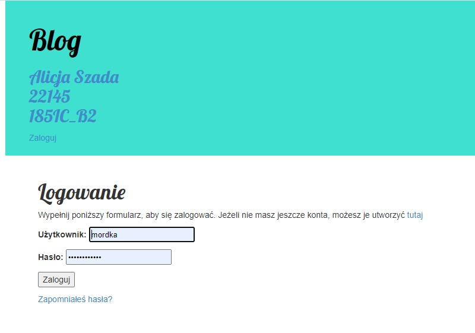  
Widok panelu głównego (wchodzi się do niego po zalogowaniu)  
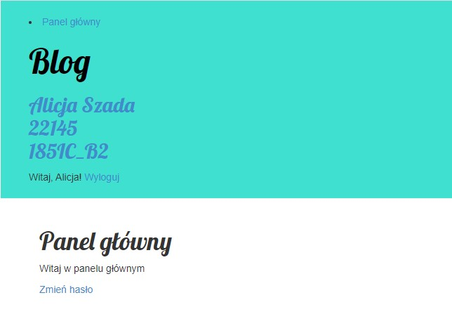  
Widok zmiany hasła
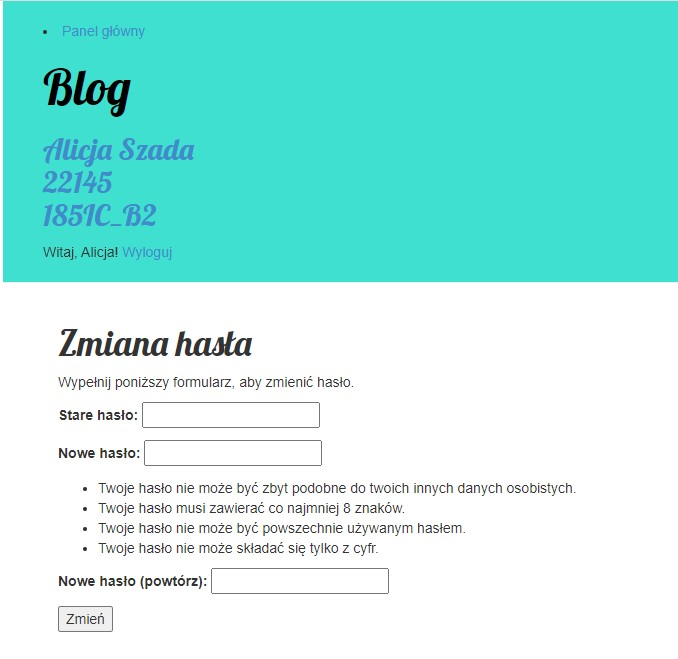  
Widok po zmianie hasła  
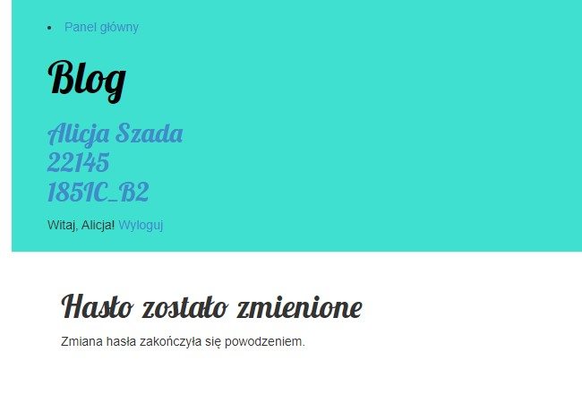
Widok tworzenia nowego konta
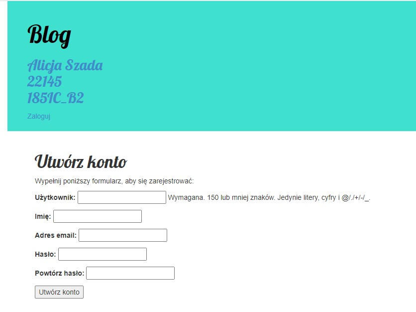
Widok po utworzeniu nowego konta
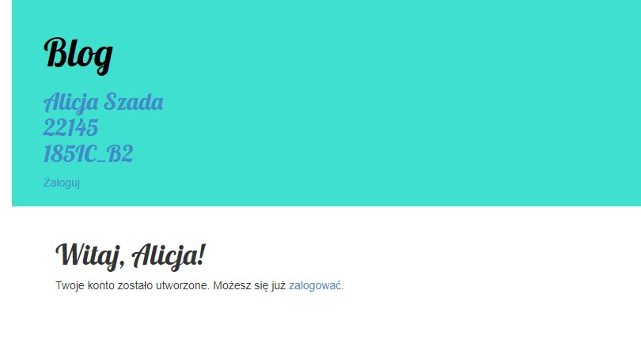
Widok po naciśnięciu przycisku "Zapomniałeś hasła?" na stronie logowania
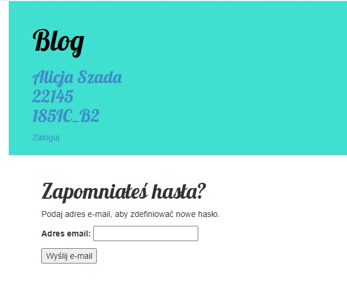
Widok po kliknięciu "Wyślij e-mail"
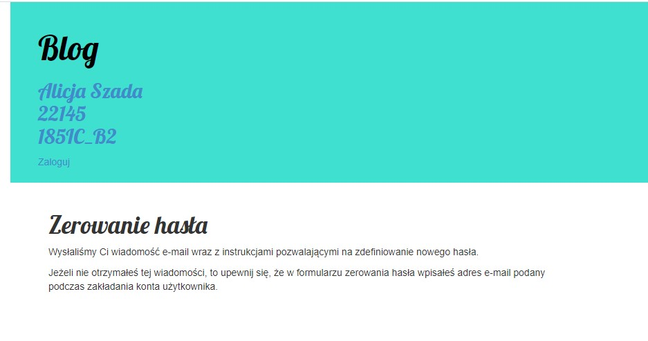
Mail wysłany za pomocą ConsoleBackend
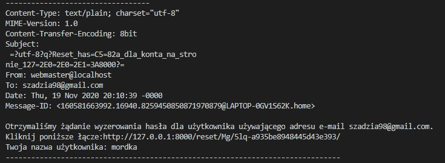
Widok po kliknięciu w link w mailu (reset hasła)
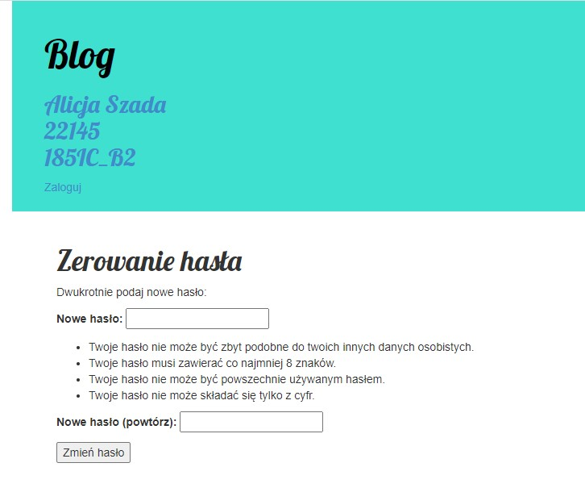
Widok po zresetowaniu hasła
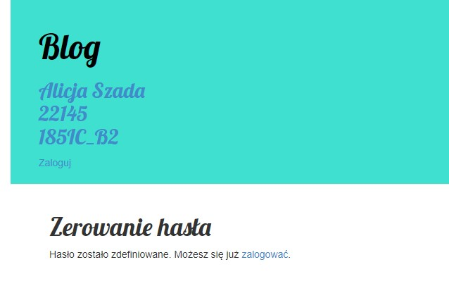
Jeśli kliknie się dwa razy w link z maila pokaże się widok:
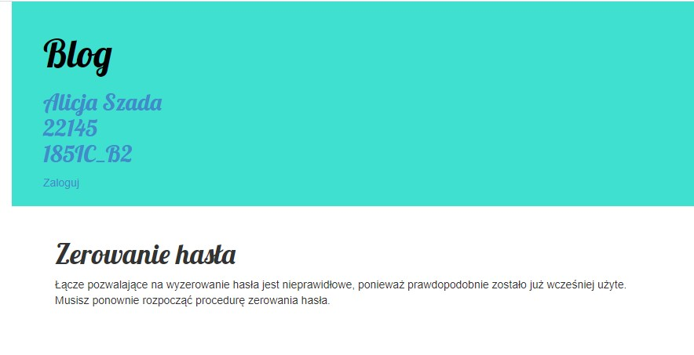

Link do blogu  
https://aplikacje-internetowe-22145.herokuapp.com/