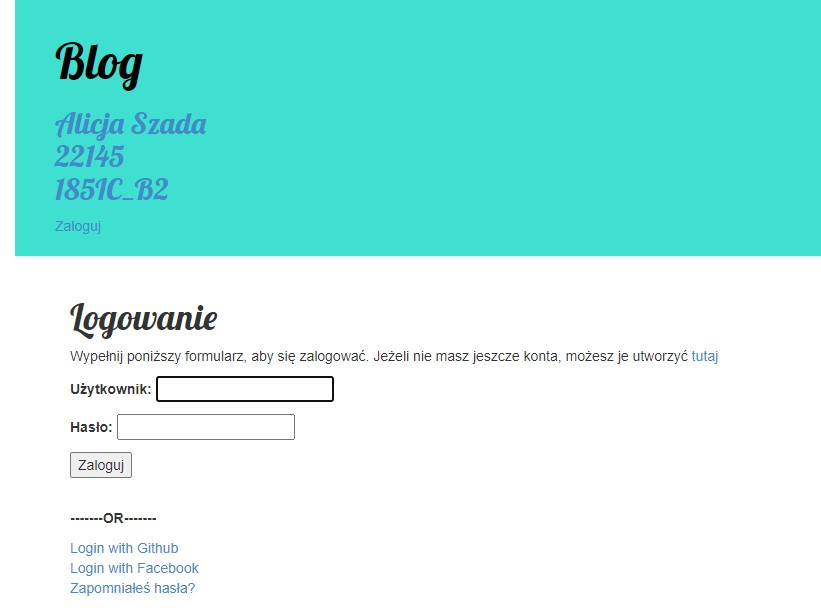

# Lab 1
## Modyfikacja blogu 
### Dodanie uwierzytelniania za pomocą social media
W folderze **Zmienione pliki** znajdują się tylko pliki zmienione   
__Reszta plików jest taka sama jak w folderze Lab2__  
Dodane backendy
Github oraz Facebook
Widok przy logowaniu/ umożliwienie logowania przez social media
  
Uwierzytelnienie przez Facebook (z uwierzyteniem przez Github jest taka sama procedura)  
  
Przejście do strony dashboard po zalogowaniu przez social media (w tym wypadku Facebook).  
  
Link do blogu  
https://aplikacje-internetowe-22145.herokuapp.com/