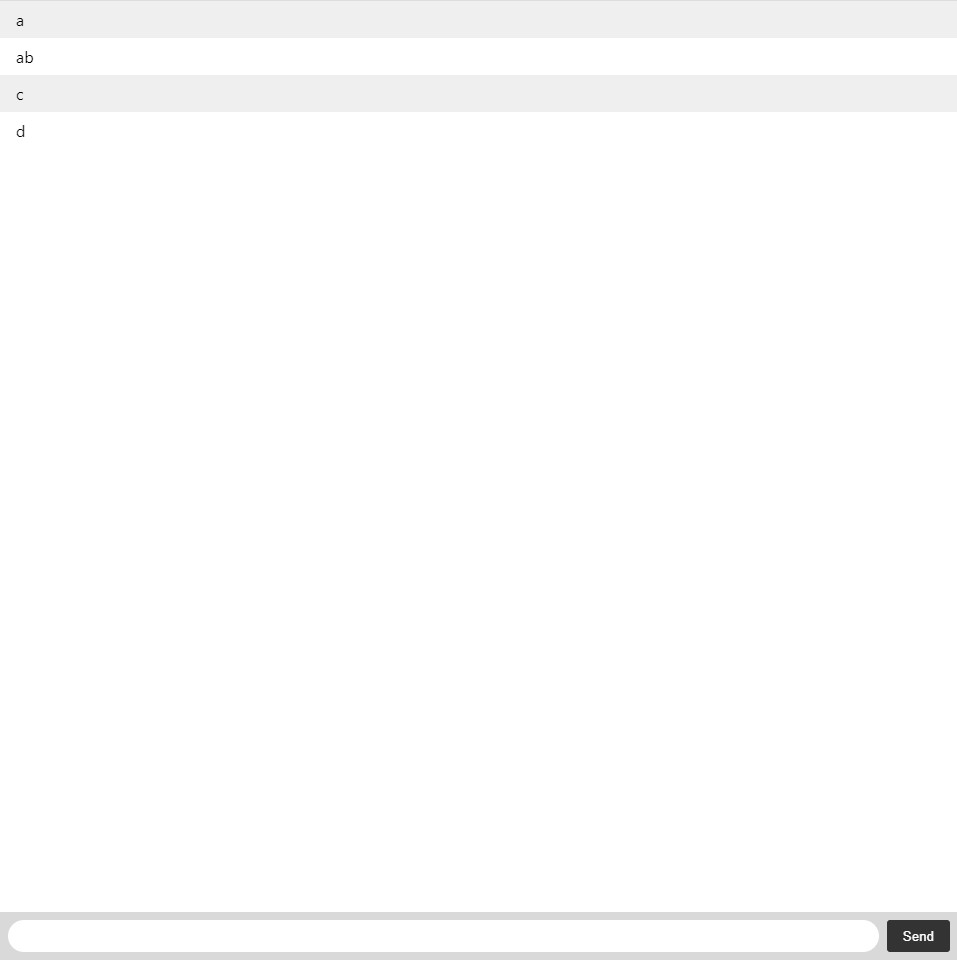
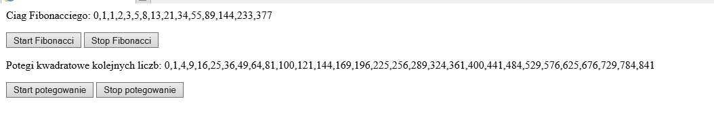
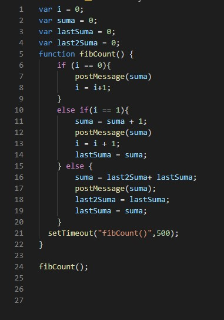
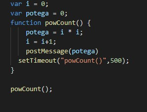

# Lab 8
## Czat z użyciem Web Socket + Web Workers
### Czat z użyciem socket.io 
Pierwszy użytkownik (napisał dwia pierwsze wpisy)  
  
Drugi użytkownik (napisał widoczne tutaj wpisy)  
  
Użycie web workers do obliczeń w tle (Ciąg Fibonacciegi oraz potęgi kwadratowe kolejnych liczb)  
  
Obliczanie ciagu  
  
Obliczanie potęg  
  